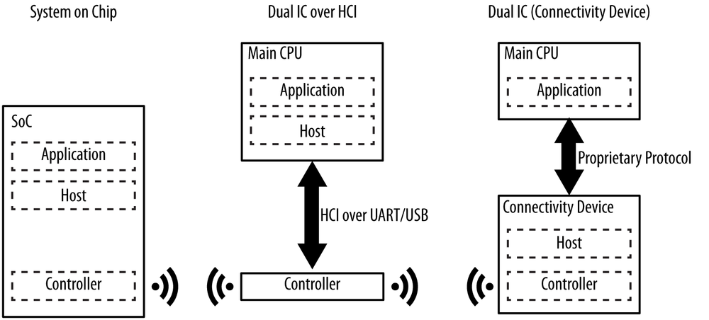
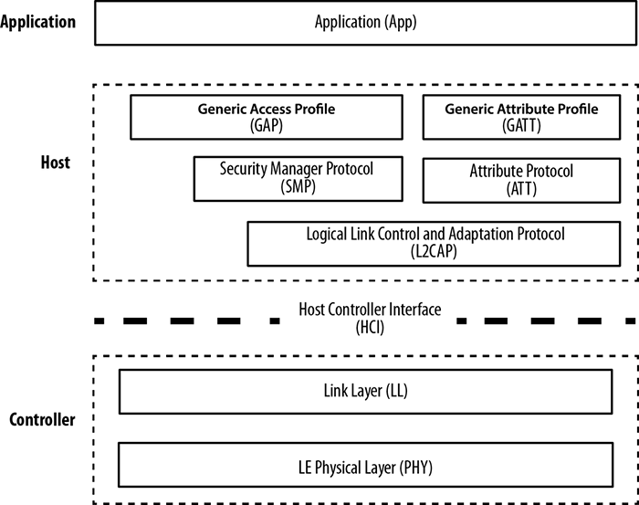
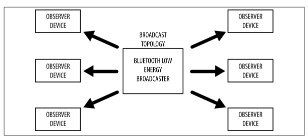
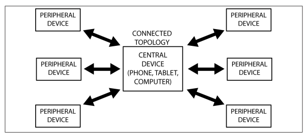

# Giới thiệu công nghệ BLE (Bluetooth Low Energy)
## Giới thiệu
- BLE (Bluetooth 4.0 trở đi) còn Classic Bluetooth (2.0), được thiết kế cho các ứng dụng: 
  - Siêu tiết kiệm năng lượng, cho phép hoạt động vài trong vài tháng hoặc vài năm với 1 viên pin đồng xu (coin-cell battery).
  - Khoảng cách ngắn, hoạt động ổn định trong phạm vi 10m.
  - Dữ liệu truyền tải không lớn, thích hợp cho các ứng dụng điều khiển không liên tục, cảm biến.

## Các khối chính của một thiết bị Bluetooth
- Mỗi thiết bị Bluetooth gồm 3 khối chính sau:
  - **Application**: Ứng dụng người dùng giao tiếp với Bluetooth protocol stack.
  - **Host**: Các lớp trên của Bluetooth protocol stack.
  - **Controller**: Các lớp dưới Bluetooth protocol stack, bap gồm chức năng truyền nhận radio

> (Bluetooth Protocol Stack: Bộ giao thức dạng stack cho phép các thiết bị Bluetooth thiết lập, kết nối, truyền nhận dữ liệu với nhau)

### HCI (Host Controller Interface)
- Giữa 2 khối **Host** và **Controller** có 1 thành phần quan trọng giúp giao tiếp và xử lý logic giữa protocol mức cao (trong ESP-IDF thì nó là *NimBLE Host*) và tầng thấp gần phần cứng thực tế đó chính là **HCI (Host Controller Interface)**
  - Là giao diện trung gian giữa **Host** và **Controller**, nói dễ hiểu:
    - Host quyết định muốn làm gì 
    - Controller thực hiện phần gần radio
    - HCI là "đường nói chuyện" giũa 2 bên.
  - Ví dụ: app của bạn gọi `ble_gap_adv_start()` thì bên Host sẽ không thể tự phát sóng được. Nó phải gửi lệnh xuống Controller kiểu như:
    - Bật Advertising
    - Dùng loại advertising nào
    - interval bao nhiêu
    - payload là gì...
    - Những lệnh/packet trao đổi giữa Host và Controller đó chính là qua **HCI**
  - **HCI** không nhất thiết phải đi trên cùng 1 kiểu transport, nó có thể đi qua: UART, SPI, USB, shared memory, internal virtual transport.
  - **HCI** thường có 3 nhóm chính: 
    - **HCI Command**: Host gửi lệnh xuống Controller (start advertising, stop advertising, set scan params, create connection,...)
    - **HCI Event**: Controller báo sự kiện ngược lên Host (advertising started, connect complete, disconnect complete, scan result received,...)
    - **HCI ACL Data**: Dữ liệu trao đổi thực sự giữa các thiết bị BLE sau khi đã kết nối (ATT read request, ATT write request, notify packet,...)

- HCI trong BLE chạy như sau: Giả sử ESP32 làm Peripheral và điện thoại connect vào
  - B1: App gọi Advertising `ble_gap_adv_start(...)`
  - B2: NimBLE Host xử lý 
    - Host chuyển yêu cầu này thành các **HCI command** xuống controller để thay đổi các tham số cấu hình cho dữ liệu cần quảng bá,...
  - B3: Controller phát sóng 
    - Controller điều khiển radio phát ra các gói BLE advertisement.
  - B4: Điện thoại connect 
    - Điện thoại gửi connect request qua radio
  - B5: Controller nhận được request từ điện thoại
    - Controller báo ngược lại Host qua **HCI Event** rằng kết nối hoàn tất
    - Host cập nhật trạng thái bằng cách gọi lại hàm callback GAP đã viết.
  - B6: GATT traffic
    - Xong khi GAP hoàn tất, GATT sẽ thực hiện tiếp phần trao đổi dữ liệu
    
- Ngoài ra còn có 1 dạng HCI được gọi là **VHCI (Virtual HCI)** hay HCI ảo/HCI nội bộ, thường dùng khi: 
  - Host và Controller không giao tiếp bằng UART vật lý ra ngoài mà giao tiếp nội bộ ngay trong SoC / firmware.
  - Espressif có cung cấp VHCI trong mã nguồn để USER có thể dễ dàng xử dụng nó như một giao diện HCI nội bộ. 
  
- Ba khối chính của một thiết bị Bluetooth được tích hợp vào phần cứng theo nhiều kiểu khác nhau, dưới đây là 3 kiểu cấu hình phần cứng chính:



### BLE Protocols Stack
- Để **lập trình** cho thiết bị BLE, có thể chỉ cần quan tâm đến các hàm API ở **lớp trên của bộ giao thức BLE** (BLE protocol stack), nhưng tốt hơn hết chúng ta nên bắt đầu với một cái nhìn **cơ bản về bộ giao thức** cho BLE, giúp cung cấp kiến thức nền tảng để có thể nghiên cứu sâu hơn về BLE.



#### Application
- Là lớp cao nhất của bộ giao thức, cung cấp giao diện người dùng, xử lý logic, và điều khiển dữ liệu của mọi thứ liên quan đến các trường hợp hoạt động của ứng dụng. Kiến trúc của Application phụ thuộc nhiều vào bài toán cụ thể.

#### Host
- Bao gồm các lớp sau: 
  - **Generic Access Profile (GAP)**

  - **Generic Attribute Profile (GATT)** (xây dựng dựa trên **ATT**)

  - **Attribute Protocol (ATT)**: là một giao thức client/server phi trạng thái đơn giản dựa trên các thuộc tính được thể hiện bởi 1 thiết bị. Trong BLE, mỗi device là một client, một server, hoặc cả 2, không phân biệt nó là master hay slave. Một client yêu cầu dữ liệu từ 1 server, và 1 server gửi dữ liệu đến client
    - Mỗi server chứa dữ liệu được tổ chức theo dạng các thuộc tính (attributes), mỗi một thuộc tính gán với 1 handle 16bit, 1 UUID (ID duy nhất), tập giới hạn quyền, 1 giá trị
    - Khi một client muốn đọc hoặc ghi giá trị thuộc tính từ/đến một server, nó phát ra một read request hoặc write request đến server với *handle*. Server sẽ đáp ứng với giá trị thuộc tính hoặc một tín hiệu ACK. Trường hợp hoạt động đọc, client phân tích giá trị và hiểu kiểu dữ liệu dựa trên UUID của thuộc tính. Khi ghi, client mong đợi để cung cấp dữ liệu với kiểu thuộc tính và server sẵn sàng để nhận

  - **Security Manager (SM)**: Chuỗi các thuật toán có thể được dùng để đảm bảo an ninh cho quá trình truyền dữ liệu qua BLE
  - **Logical Link Control and Adaption Protocol (L2CAP)**: 2 chức năng chính:
    - Như 1 giao thức dồn kênh, từ nhiều giao thức lớp trên rồi đóng gói thành định dạng gói BLE chuẩn và ngược lại
    - Phân mảnh và tái liên kết hợp: lấy các gói dữ liệu lớn từ các lớp trên và chia chúng thành các gói BLE 27 byte tại bên truyền. Tại bên nhận nó làm ngược lại.
  - **Host Controller Interface (HCI) - Host side**

#### Controller
- Bao gồm các lớp sau: 
  - **Host Controller Interface (HCI) - Controller side**: giao diện để kết nối giữa host và controller
  - **Link Layer (LL)**: quản lý liên kết, được cài đặt ở cả phần mềm và phần cứng: 
    - Preamble, Access Address, air protocol framing.
    - CRC generation and verification
    - Data whitening, Random number generation, AES encryption
  - **Physical Layer (PHY)**: là lớp thấp nhất làm nhiệm vụ truyền nhận tín hiệu
    - Chuyển đổi qua lại giữa tín hiệu số và tương tự
    - Điều chế và giải điều chế tín hiệu 
    - Dải tần sử dụng 2.4GHz ISM, chia làm 40 kênh từ 2.4GHz đến 2.4835GHz

## Các giới hạn chính của BLE
### Thông lượng dữ liệu nhỏ 
- Tần số điều chế của sóng BLE trong không gian là **1Mbps**. Đây là giới hạn trên của thông lượng theo lý thuyết. Tuy nhiên trong thực tế tham số này nhỏ hơn do ảnh hưởng của nhiều yếu tố

- Ta có khái niệm chu kỳ kết nối (**Connection interval**), đây là khoảng thời gian giữa 2 sự kiện kết nối liên tiếp. Với BLE, khi một sự kiện kết nối diễn ra, các thiết bị trong kết nối sẽ trao đổi dữ liệu với nhau, sau đó trở về trạng thái IDLE để tiết kiệm năng lượng, và chờ đến thời điểm thì thực hiện kết nối tiếp theo. Tham số này nằm trong khoảng 7.5ms -> 4s

### Khoảng cách gần
- Khoảng cách lý thuyết: 100m (điều kiện tốt).
- Khoảng cách khả thi: 30m.
- Khoảng cách thường được sử dụng: 2-5m.

### Mô hình mạng truyền thông cho BLE
- Một thiết bị BLE có thể giao tiếp với bên ngoài thông qua 2 cơ chế: **Broadcasting** hoặc **Connection**. Mỗi cơ chế có thế mạnh và giới hạn riêng, cả hai được thiết lập với GAP (*Generic Access Profile)*


- **Thiết bị Broadcaster**: Gửi các gói tin quảng bá phi kết nối đến bất kỳ thiết bị nào có thể nhận (như *thiết bị không dây đặc thù (tai nghe không dây, loa,...)*)
- **Thiết bị Observer**: Quét liên tục theo tần số đặt trước để nhận gói tin quảng bá phi kết nối (như *điện thoại quét các thiết bị xung quanh nó*)

- Đây là kiểu **truyền thống** cho phép một thiết bị có thể truyền dữ liệu đến thiết bị khác cùng lúc (một chiều). Đây là cơ chế nhanh chóng và dễ sử dụng nếu muốn truyền lượng nhỏ dữ liệu đến nhiều thiết bị cùng lúc. Hạn chế là dữ liệu không được bảo đảm an ninh, vì thế không phù hợp để truyền các dữ liệu nhạy cảm.


- **Thiết bị Central (Master)**: Quét các gói tin quảng bá hướng kết nối theo tần số đặt trước, khi phù hợp thì khởi tạo một kết nối với một peripheral. Central quản lý timing và bắt đầu những sự trao đổi dữ liệu theo chu kỳ (*Master ở đây là thiết bị gửi data, ví dụ như điện thoại, máy tính...*). Thiết bị nào quét các gói tin quảng bá và thực hiện kết nối thì là **Central**.

- **Thiết bị Peripheral (Slave)**: Phát các gói tin quảng bá hướng kết nối theo chu kỳ và chấp nhận kết nối do central yêu cầu (*Thiết bị nhận data như loa, tai nghe không dây...*). Thiết bị nào quảng bá gói tin đi nơi khác thì là **Peripheral**.

### Khởi tạo kết nối
- Khi muốn kết nối, slave phát các gói tin quảng bá ra không gian
- Central nhận được các gói tin quảng bá của Slave, trong đó chứa các thông tin cần thiết cho phép kết nối với Slave đó
- Dựa trên đó, Central gửi yêu cầu kết nối đến Slave để thiết lập một kết nối riêng giữa 2 thiết bị
- Khi kết nối được thiết lập, slave dừng quảng báo và hai thiết bị có thể trao đổi dữ liệu 2 chiều.

# Protocol và Profiles
Để hai thiết bị có thể giao tiếp với nhau thông qua chuẩn BLE, các thiết bị BLE cần tuần thủ một số quy định. Các quy định này được khái quát hóa các giao thức và cấu hình: 

## Protocol (Giao thức)
- Tập các luật quy định việc định dạng gói tin, định tuyến, dồn kênh, mã hóa,...để trao đổi dữ liệu giữa các bên. 

## Profile (Cấu hình)
- Định nghĩa cách mà giao thức được dùng để đạt các mục tiêu cụ thể. Có thể hiểu nó là cách để các thiết bị có thể tìm thấy nhau và gửi thông tin cho nhau. Có hai loại cấu hình là **cấu hình chung** (*generic profiles*) và **cấu hình cụ thể theo trường hợp sử dụng** (*use-case profiles*)
  - **Generic profile**: Các profile cơ sở được định nghĩa trong tài liệu Bluetooth Specifications, đặc biệt là hai profiles không thể thiếu giúp các thiết bị BLE kết nối và trao đổi dữ liệu với nhau, GAP và GATT

  - **Use-case profile**: Các profile cho các trường hợp sử dụng cụ thể
    - Các profile do Bluetooth Special Interest Group (SIG) định nghĩa.
    - Các profile do vendor tự định nghĩa.

# GAP và GATT trong Bluetooth/BLE (Bluetooth Low Energy) là gì ? 
## GAP (Advertising and Connections)
- GAP (Generic Access Profile) là nền tảng cho phép các thiết bị BLE giao tiếp với nhau. Nó cung cấp một framework mà bất cứ thiết bị BLE nào cũng phải tuân theo để có thể tìm kiếm các thiết bị BLE khác, quảng bá dữ liệu, thiết lập kết nối an ninh, thực hiện nhiều hoạt động nền tảng theo một chuẩn.
- Hiểu đơn giản là cách thiết bị BLE "tìm thấy nhau và kết nối với nhau" **(Quản lý kết nối & Luồng truyền thông)**. Nó quản lý đường ống kết nối vật lý qua sóng Radio giữa 2 con chip BLE.
- Tài liệu BLE Specifications định nghĩa các khái niệm sau khi xét đến sự tương tác giữa các thiết bị: 

  - **Roles**: Một thiết bị có thể hoạt động theo một hoặc nhiều vai trò khác nhau tại cùng một thời điểm: *broadcaster, observer, central, peripheral*.

  | Role | Làm gì ? | Ví dụ | 
  |------|----------|-------|
  |Broadcast | Chỉ phát quảng bá | Beacon | 
  |Observer | Chỉ quét | Điện thoại scan |
  |Peripheral | Phát quảng bá + chấp nhận kết nối | Cảm biến | 
  |Central | Quét + tạo kết nối | Điện thoại | 

  - **Modes**: Một mode là một trạng thái mà thiết bị có thể chuyển đến trong 1 khoảng thời gian để đạt được một mục đích cụ thể hoặc nhiều điều đặc biệt, để cho phép một peer thực hiện một thủ tục cụ thể.

  - **Procedures**: Là các thủ tục (thường thì Link Layer điều khiển sự trao đổi gói tin) để cho phép một thiết bị đạt được một mục đích chắc chắn. Một thủ tục thường được liên kết với một mode, nên mode và procedure thường được xem xét cùng nhau.

  - **Security**: GAP xây dựng dựa trên Security Manager và Security Manager Protocol (định nghĩa các modes và procedures an ninh để xác định cách mà các thiết bị đặt mức an ninh khi trao đổi dữ ).

- Xét về cách bản chất thì GAP là lớp điều khiển cao nhất của BLE và cấu hình bắt buộc cho tất cả thiết bị BLE.

## GATT (Services and Characteristics)
- GATT thiết lập chi tiết cách trao đổi profile và dữ liệu người dùng qua kết nối BLE. Ngược lại với (định nghĩa sự tương tác mức thấp với các thiết bị), GATT chỉ trình bày thủ tục truyền và định dạng dữ liệu thực tế.
- Hiểu đơn giản GATT định nghĩa cách dữ liệu tổ chức và truyền dữ liệu sau khi đã kết nối. Nếu GAP là cách làm quen thì GATT là cách nói chuyện **(Bản đồ dữ liệu)**. Giống như ngôi nhà, định nghĩa ô RAM nào chứa dữ liệu gì, GATT chỉ có nhiệm vụ quản lý cấu trúc chứ không có cơ chế quản lý luồng chạy ngầm của hệ điều hành.
- GATT được xây dựng trên ATT và giao thức truyền của nó để trao đổi dữ liệu giữa các thiết bị. Dữ liệu này được tổ chức phân cấp thành các phần: 
  - *Device* (thiết bị) có thể chứa nhiểu *Services* (dịch vụ), mỗi *Services* nó nhóm các phần khái niệm của dữ liệu người dùng gọi là *Characteristics* (Đặc tính), và mỗi *Characteristic* có thể có các thuộc tính mở rộng gọi là *Descriptor* (Mô tả). Nói 1 cách ngắn gọn thì dữ liệu truyền qua BLE là dữ liệu có cấu trúc, mà cụ thể là được tổ chức phân cấp thành *Services* và *Characteristic*.
```bash
# GATT to chuc du lieu theo mo hinh
Device
 └── Services
       └── Characteristic
              └── Descriptor
```

### 1. Attributes (Thực thể tầng đáy)
- **Attributes**: Là thực thể dữ liệu nhỏ nhất được định nghĩa bởi GATT (và ATT)
- Bản chất cả GATT và ATT ở tầng sâu phần cứng chỉ làm việc với định dạng duy nhất là **Attribute**. Mọi Service, Characteristic hay Descriptor muốn tồn tại trong RAM của BLE Stack thì bắt buộc phải được băm nhỏ ra thành các dòng Attribute.
- Mỗi Attribute như 1 dòng trong bảng cơ sở dữ liệu, chứa thông tin duy nhất về chính nó bao gồm 4 trường thành phần: 

```bash
  # Định dạng thuộc tính của giao thức ATT
  Attribute = 
  - Handle (ID 16-bit)
  - UUID
  - Permission
  - Value
```

  - *Handle*: số 16-bit duy nhất do BLE stack cấp phát cho trên mỗi Attribute trên GATT server để địa chỉ hóa Attribute. Client sẽ dùng handle này để chỉ đích danh ô dữ liệu cần tương tác.

  - *Type*: là **UUIDs** - một số định danh thiết bị, dài 128 bit (16 byte) duy nhất trên thế giới. Vì độ dài này quá, chiếm phần lớn trong gói dữ liệu, BLE Specification định nghĩa thêm 2 định dạng UUID: 16bit và 32bit. Các định dạng này có thể chỉ được sử dụng với UUID được định nghĩa trong BT Specification.

  - *Permission*: xác định các thao tác (ATT operation) mà Client có thể thực thi trên Attribute cụ thể nào đó.

  - *Value*: Chứa phần dữ liệu thực tế trong attribute, giới hạn 512 bytes

### 2. Characteristic (Thực thể tầng ứng dụng)
- **Characteristic** là tập hợp gom nhóm của nhiều **Attribute** đứng sát cạnh nhau để biểu diễn cho 1 thực thể dữ liệu người dùng hoàn chỉnh. Để định nghĩa 1 **Characteristic**, phần cứng BLE stack cần bắt buộc phải dùng tối thiểu 2 đến 3 **Attribute** liên tiếp với cấu trúc như sau:
  - **Attribute số 1**: Characteristic Decleration (Khai báo Đặc tính)
    - *UUID của dòng này:* Luôn chứa mã cố định `0x2803` (được Bluetooth SIG quy định).
    - *Value của dòng này:* Chứa các thông tin cấu hình cốt lõi của Đặc tính bao gồm: Quyền GATT (Read/Write/Notify), địa chỉ Handle của dòng dữ liệu thật ngay phía dưới và UUID thật đặc tính của nó.
    - *Ý nghĩa*: Dòng này đóng vai trò như một bảng biểu chỉ dẫn để GATT Client quét qua và biết được "*Sắp có một Đặc tính xuất hiện phía sau, nó có quyền Notify và dữ liệu của nó mang UUID này.*"
  - **Attribute số 2**: Characteristic Value (Giá trị đặc tính)
    - *UUID của dòng này*: Mang mã UUID thật do USER tự định nghĩa (ví dụ: UUID của gói tin Bio/Audio)
    - *Value của dòng này*: Đây chính là nơi chứa dữ liệu thô thực tế mà bạn muốn truyền nhận (ví dụ: lưu mảng `201 bytes` chứa dữ liệu nhị phân ECG + PPG). Khi Client phát lệnh Read/Write, nó sẽ trỏ thẳng vào Handle của dòng này.
  - **Attribute số 3**: Client Characteristic Configuration Descriptor - CCCD (Mô tả cấu hình - Không bắt buộc)
    - *UUID của dòng này*: Luôn mang mã cố định `0x2902` 
    - *Value của dòng này*: là một mảng 2 bit (Mặc định bằng `0x0000`)
    - *Ý nghĩa*: Ô nhớ này **chỉ xuất hiện nếu Characteristic của bạn bật thuộc tính `NOTIFY` hoặc `INDICATE`. Khi điện thoại kết nối vào và ấn nút "Bật nhận thông báo", Điện thoại sẽ ghi giá trị `0x0001` vào ô CCCD này. ESP32 kiểm tra thấy ô này bằng 1 thì mới được phép chủ động bắn gói tin ra không gian.

- **Roles**
  - **GATT Client**: tương ứng với ATT Client, gửi yêu cầu đến Server và nhận kết quả phản hồi. Ban đầu, GATT Client không biết Server hỗ trợ những thuộc tính nào vì thế nó cần phải thực hiện **Service Discovery**.
  - **GATT Server**: tương ứng ATT Server, nhận yêu cầu từ Client và gửi những nội dung tương ứng.

- **Chú ý** rằng các vai trò của GATT không phụ thuộc vào vai trò của GAP, có nghĩa là cả GAP Central và GAP Peripheral có thể hoạt động như GATT Client hoặc GATT Server hoặc thậm chí là cả 2 cùng tại 1 thời điểm


- Ví dụ khi viết ESP32 (Peripheral + Server) có nghĩa là ESP32: 
  - GAP Role: Peripheral
    - Khi đó ESP32 sẽ đóng vai trò quảng bá bản tin, để đợi cho thiết bị còn lại scan và chấp nhận yêu cầu kết nối. ESP32 không chủ động **connect**.
  - GATT Role: Server
    - Sau khi kết nối thành công với Central thì trong GATT, ESP32 sẽ là **GATT Server** chứa data để gửi cho thiết bị kia. 
    - Data này sẽ được tổ chức theo mô hình Service, Characteristic. Trong mỗi Characteristic lại có value để thiết bị đóng vai trò là **GATT Client** còn lại kia có thể đọc/ghi hoặc đăng ký nhận thông báo từ Server này.

**ESP32**:
| Layer | ESP32 role |
| ----- | ---------- |
| GAP   | Peripheral |
| GATT  | Server     |

**Điện thoại, máy tính,...**
| Layer | Phone role |
| ----- | ---------- |
| GAP   | Central    |
| GATT  | Client     |

